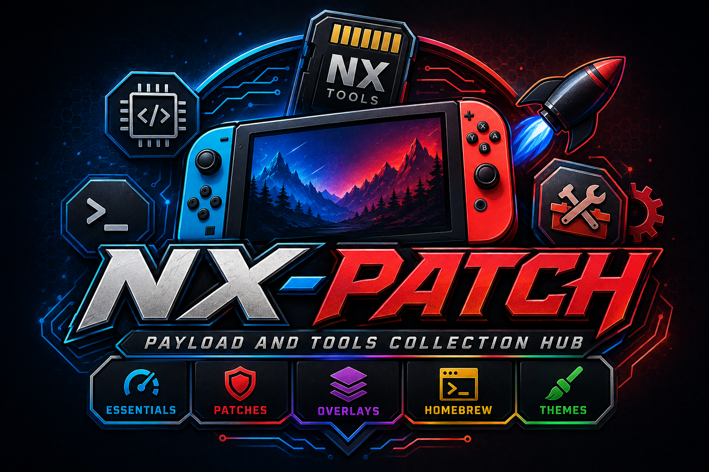

# NX-Patch

### Payload And Tools Collection Hub

A streamlined bundle for modded Nintendo Switch systems, combining essential
payloads, patches, and utilities into one organized toolkit. Designed for
simplicity, speed, and reliability, NX-Patch keeps your Switch modding
workflow efficient and up to date.

---

## Included Components

### Essentials

| Component | Version | Repository |
|-----------|---------|------------|
| hekate | `v6.5.3` | [CTCaer/hekate](https://github.com/CTCaer/hekate) |
| Atmosphere | `1.11.2` | [Atmosphere-NX/Atmosphere](https://github.com/Atmosphere-NX/Atmosphere) |
| sys-patch | `v1.6.2.3` | [borntohonk/sys-patch](https://github.com/borntohonk/sys-patch) |
| modchip-toolbox | `v1.0.3` | [DefenderOfHyrule/modchip-toolbox](https://github.com/DefenderOfHyrule/modchip-toolbox) |
| Lockpick_RCMaster | `2.0.0` | [THZoria/Lockpick_RCMaster](https://github.com/THZoria/Lockpick_RCMaster) |

### Patches

| Component | Version | Repository |
|-----------|---------|------------|
| disable_remap_dialog | `v1.0.13` | [ndeadly/disable_remap_dialog](https://github.com/ndeadly/disable_remap_dialog) |
| MissionControl | `v0.15.2` | [ndeadly/MissionControl](https://github.com/ndeadly/MissionControl) |
| SaltyNX | `1.9.3` | [masagrator/SaltyNX](https://github.com/masagrator/SaltyNX) |

### Overlays

| Component | Version | Repository |
|-----------|---------|------------|
| nx-ovlloader | `v2.0.2` | [ppkantorski/nx-ovlloader](https://github.com/ppkantorski/nx-ovlloader) |
| Ultrahand-Overlay | `v2.5.3` | [ppkantorski/Ultrahand-Overlay](https://github.com/ppkantorski/Ultrahand-Overlay) |
| Status-Monitor-Overlay | `v1.4.1+r4` | [ppkantorski/Status-Monitor-Overlay](https://github.com/ppkantorski/Status-Monitor-Overlay) |
| NX-FanControl | `1.0.3+r4` | [ppkantorski/NX-FanControl](https://github.com/ppkantorski/NX-FanControl) |
| EdiZon-Overlay | `v1.0.15` | [proferabg/EdiZon-Overlay](https://github.com/proferabg/EdiZon-Overlay) |
| QuickNTP | `1.6.0+r6` | [ppkantorski/QuickNTP](https://github.com/ppkantorski/QuickNTP) |
| ovl-sysmodules | `v1.5.3` | [ppkantorski/ovl-sysmodules](https://github.com/ppkantorski/ovl-sysmodules) |
| Horizon-OC | `2.5.1` | [Horizon-OC/Horizon-OC](https://github.com/Horizon-OC/Horizon-OC) |
| Status-Monitor-Deux | `0.2.1` | [masagrator/Status-Monitor-Deux](https://github.com/masagrator/Status-Monitor-Deux) |
| FPSLocker | `3.3.2` | [masagrator/FPSLocker](https://github.com/masagrator/FPSLocker) |
| emuiibo | `1.1.3` | [XorTroll/emuiibo](https://github.com/XorTroll/emuiibo) |

### HomeBrew

| Component | Version | Repository |
|-----------|---------|------------|
| Prelude-Nro | `v3.3.9` | [NextendoNetwork/Prelude-Nro](https://github.com/NextendoNetwork/Prelude-Nro) |
| sphaira | `1.0.6` | [ITotalJustice/sphaira](https://github.com/ITotalJustice/sphaira) |
| JKSV | `12/02/2025` | [J-D-K/JKSV](https://github.com/J-D-K/JKSV) |
| linkalho | `v2.0.2` | [impeeza/linkalho](https://github.com/impeeza/linkalho) |
| SwitchThemeInjector | `nxt-3.0.1` | [exelix11/SwitchThemeInjector](https://github.com/exelix11/SwitchThemeInjector) |
| CyberFoil | `1.4.6` | [luketanti/CyberFoil](https://github.com/luketanti/CyberFoil) |
| DBIPatcher | `905` | [rashevskyv/DBIPatcher](https://github.com/rashevskyv/DBIPatcher) |
| Amiigo | `2.4.1` | [CompSciOrBust/Amiigo](https://github.com/CompSciOrBust/Amiigo) |
| Moonlight-Switch | `v1.5.0` | [XITRIX/Moonlight-Switch](https://github.com/XITRIX/Moonlight-Switch) |
| pipensx | `1.4.4` | [i3sey/pipensx](https://github.com/i3sey/pipensx) |
| pemu | `v7.2` | [Cpasjuste/pemu](https://github.com/Cpasjuste/pemu) |
| twiNX | `v0.9.1` | [DomazinUS/twiNX](https://github.com/DomazinUS/twiNX) |
| aio-switch-updater | `2.23.3` | [HamletDuFromage/aio-switch-updater](https://github.com/HamletDuFromage/aio-switch-updater) |
| SaltyNX-Tool | `1.1.1` | [masagrator/SaltyNX-Tool](https://github.com/masagrator/SaltyNX-Tool) |
| ppsspp-switch-community-build | `v0.6.5` | [SirSamael/ppsspp-switch-community-build](https://github.com/SirSamael/ppsspp-switch-community-build) |

### Themes

| Component | Version | Repository |
|-----------|---------|------------|
| theme-patches | `master` | [exelix11/theme-patches](https://github.com/exelix11/theme-patches) |

---

## Usage

1. Download the latest release from the [Releases](https://github.com/techroy23/Nx-Patch/releases) page
2. Extract the contents to the root of your Switch SD card
3. Done!
